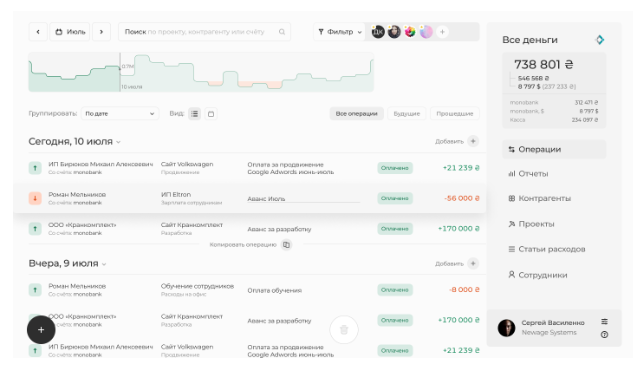

## Test task for front-end developer

 [Live demo](https://glem1337.github.io/decision/)
 
 ## Getting started
 
 - Clone this repo
 - `npm install` to install all required dependencies
 - `npm start` to start the local server (this project uses create-react-app)
 
## Used tools
- node version 12.16.3
- react-create-app;
- ReactJS;
- react-dnd;
- tailwindcss;
- classnames;
- node-sass;
- react-textarea-autosize;

## Task
Перенести дизайн из [Figma](https://www.figma.com/file/esArQboNZ4aJFlge5buqR0/Test-Project?node-id=0%3A1) на один из JavaScript фреймворков (Angular/React/Vue).

1. Разбейте на компоненты
2. Используйте Tailwind-Css
3. Используйте тот фреймфорк, по которому вы проходите собеседование
4. График - экспорт SVG из Figma
5. Сделать drag&drop (копировать/удалить)

